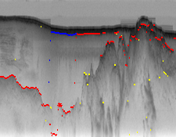
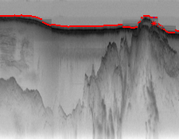
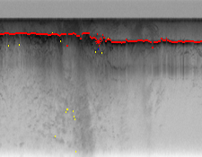
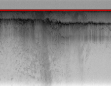
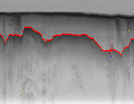
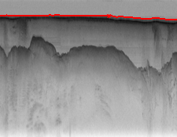

# psabade-rpharate-sragade-a3
a3 created for psabade-rpharate-sragade

# Part 1

We have Used 3 Algo for POS tagging 

Simplified Bayes Model
HMM
MCMC

In Training,
We calculated the word count,label count,transition count,etc with the help of dictionary using training dataset
and then calculated intial probability,Transition Probability and Emission probabilty.

For Simplified Bayes Model 
we just predicted the labels of the word or Pos of word by just finding out maximum probabilty of that word in labels
There were 12 Labels from which we selected the label that has maximum probability for that word.
We got pretty good accuracy using Bayes model 
the accuracy we got was around 92% for words and around 40% for sentences

For HMM,
There were 12 States like noun,adv,adj,x,etc.
so we created VTable of 144 and then did calculations according to viterbi algorithm to find most likely sequence.
In Viterbi we considered 3 Probabilities like Emission,Transition and Intial and did calculations.
we find out the maximum and then Back tracked to get the sequence 
The Accuracy we got using Viterbi was Highest among all 3 was around 94.9% for words and 53% for sentences

We refered Professor David Crandall's code given during In Class Activity 2 ,to find sequence using viterbi.

For Complex MCMC
we implemented Gibbs Sampling,
were we intialised the sequence with any states and then implemented the algorithm to get most likely sequence by iterating.
The accuracy we got was pretty good and similar to Bayes model

Posterior Calculations

We calculated posterior for each algorithm according to there net structure

Problems Faced

There were new words for that we dont have probabilities so we intialised them to small probabilities
There were situations when probabilities were too small we were getting math domain error for math.log 
it was handeled 

# Part 2 
 
 

 
 
 
 

**Implementing Using Naive bayes:** 
In this, for emission probablity we are using the edge strength which denoted the change in pixel brightness. Edge strength code was used from skeleton code.We are also using the pixel brightness as factor.
In naive bayes, we are simply choosing the pixel with the maximum emission probablity. We make sure that we air-ice interface is above the ice-rock interface by assigning weights to pixel so that pixels of ice-rock interface should always be 10 pixel below air-ice.   
**Implementing HMM:** 
For implementing using viterbi,we use transition probablities. For calculating transition probablity, we use the distance of the current pixel from the pixel in the interface from the last column. If this distance is more, then the probablity is less. We use the same emission probablity as in Naive bayes. Viterbi algorithm used from in class activity. 
**Implementing HMM with Human feedback:** 
There is always a trade off between emission probablity and transition probablity. Sometimes because of noise, the HMM can get completely misguided. As in case of image 23. We can give feedback to improve performance. The probablity of pixel given by human is made the highest. So that the algorithm chooses that pixel. Then choose the next pixel using this pixel and so on. 
**Challenges faced:** 
Image 23 has lot of noise, which cause the result to be less accurate. The accuracy increases with human feedback.

# Part 3
------------------------------------------------------------------------------------------------------------------------------------------------------

As we need to implement HMM, I started with calculating transition, emission and initial probabilities for each word in the training set. I had created a dict (word_freq) with each word as key and value of that key is a another dict with keys as {'count':1,'initial_count':0,'ADJ':0,'ADV':0,'ADP':0,'CONJ':0,'DET':0,'NOUN':0,'NUM':0,'PRON':0,'PRT':0,'VERB':0,'X':0,'.':0}. I was using the count key for calculating prior probability , initial_count key to calculate initial probability of that particular word and other keys to calculate emission probabilities for each label for each word. For transition probability i had made as 12*12 dict of dict (you can see it in the code). here i was calculating probability of NOUN->NOUN, NOUN->ADJ, NOUN->CONJ basically every possible transition of pos. initially i thaught it wil be needed for Viterbi. But, spending so much time on this i realised this will not help :). I have kept my code for this part in the file. Please check calculate_probabilities function to check it out.

After that, i started again, this time i wanted to implement bayes net first and then move to viterbi. I completed the implementation for bayes net but accuracy was not that great.For test_image-0_0 i was getting below output -->Simple: SUPREME CQURT?QEjTHE UNITEDpSTATES. As you can see accuracy was not that great. I experimented a lot to increase the accurecy like taking into account black_non_matched pixels, whites pixels but it didn't increase the accuracy when the image had a lot of noise. So, after a lot of experimentation with assigning weights for emmision probability i observerd that when the input image has a lot of noise then assigning more weight for black_matched pixels gives accurate results and when the pixel density is less then assigning slightly less weight to back_match pixels gives accurate results. So I have incorporated this logic for getting different emission prob based on the density of the image.

For viterbi I started with calculating emission probabilities and initial probabilities based on the training data. Viterbi seemed very hard and i was not able to do it. I watched the module for viterbi once again but still was not able to clearly think how to implement it. One of my teammate told me about the viterbi code provided by Prof. David in one of the in class activity. So, i looked at the code and implemented similar logic for my problem and it worked !! (I was so happy ;) ). I got some issues like probabilities mutplications were giving 0 ans, string was not correct etc but i was able to fix everything and now getting a decent output.

First letter of the string is getting printed wrong somehow. I looked at my logic for calculating initial_probabilities and made few changes but still not able to get correct ans for first letter. I don't know what to do for that part

For all the test images provided (0-19) i am able to get accuracy of over 90% (I think) and I'm happy with it.
